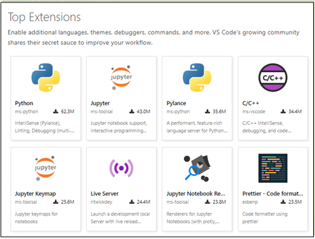
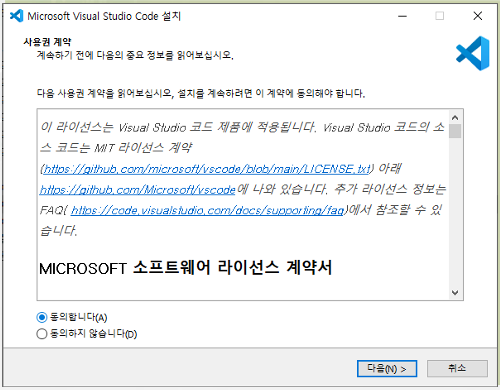

# 비주얼 스튜디오 코드
## Visual Studio Code
* MS사가 개발하는 오픈 소스 에디터 소프트웨어, 간단히 ㅍㄴ챙ㄷ
* Electron으로 만든 open source license로 만든 code editor

## 가볍지만 강력한 소스 코드 편집기
* 데스크톱에서 실행
* Sindows,macOS 및 Linux에서 사용 가능
## JavaScript, TypeScript 및 Node.js를 기본적으로 지원
* 다른 언어 (예 : C ++, C #, Java, Python, PHP, Go) 및
런타임(예 : .NET 및 Unity)에 대한 풍부한 확장 기능 에코 시스템
## VSCODE Marketplace 활용
* 아주 간단한 것부터 '또 하나의 프로그램'이라 느낄정도로 복잡한 것까지 수 많은extension 사용 가능 

## 파일 편집과 버전관리도 지원

# vscode 설치
## 다운로드
* https://code.visualstudio.com/
* VSCodeSetup-x64-1.XX.X.exe

## 버전 종류
### 유저 버전(User installer)
* 현재 사용자만 설치 가능한 버전
* 사용자 폴더에 설치
### 시스템 버전(System installer)
* 해당 컴퓨터에 모든 사람이 사용 가능
* 시스템 설치 기본 폴더
* C:\Program Files\Microsoft VS Code
* 공용 버전으로 사용하는 것을 추천
# 확장(extensions) 패키지
</img> 
# 설치과정(1/3)
</img> 
# 설치과정(1/3)
</img> 
# 설치과정(1/3)
</img> 
