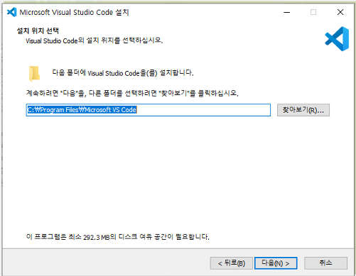
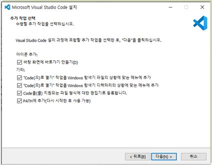
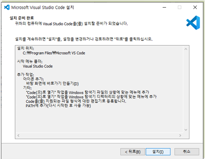
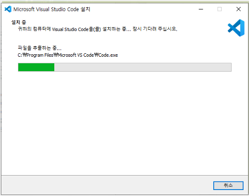
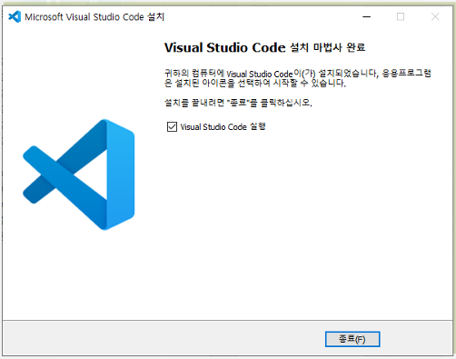
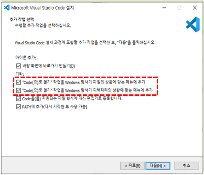
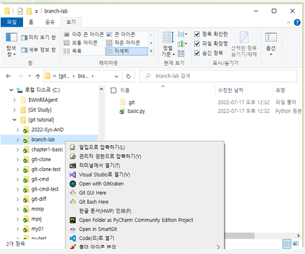
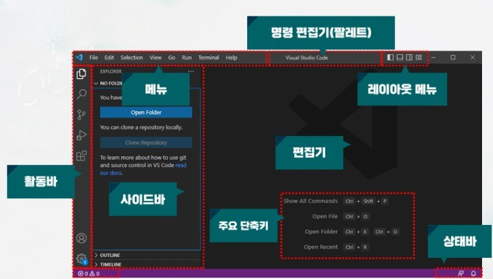
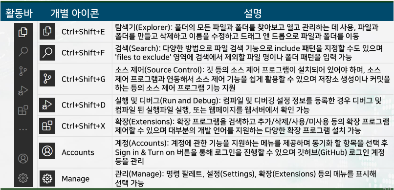

# 비주얼 스튜디오 코드
## Visual Studio Code
* MS사가 개발하는 오픈 소스 에디터 소프트웨어, 간단히 vscode
* Electron으로 만든 open source license로 만든 code editor

## 가볍지만 강력한 소스 코드 편집기
* 데스크톱에서 실행
* Sindows,macOS 및 Linux에서 사용 가능
## JavaScript, TypeScript 및 Node.js를 기본적으로 지원
* 다른 언어 (예 : C ++, C #, Java, Python, PHP, Go) 및
런타임(예 : .NET 및 Unity)에 대한 풍부한 확장 기능 에코 시스템
## VSCODE Marketplace 활용
* 아주 간단한 것부터 '또 하나의 프로그램'이라 느낄정도로 복잡한 것까지 수 많은extension 사용 가능 

## 파일 편집과 버전관리도 지원

# vscode 설치
## 다운로드
* https://code.visualstudio.com/
* VSCodeSetup-x64-1.XX.X.exe

## 버전 종류
### 유저 버전(User installer)
* 현재 사용자만 설치 가능한 버전
* 사용자 폴더에 설치
### 시스템 버전(System installer)
* 해당 컴퓨터에 모든 사람이 사용 가능
* 시스템 설치 기본 폴더
* C:\Program Files\Microsoft VS Code
* 공용 버전으로 사용하는 것을 추천
# 확장(extensions) 패키지
</img> 
# 설치과정(1/3)
</img> 
# 설치과정(1/3)
</img> 
# 설치과정(1/3)
</img> 
# 설치과정(2/3)
### 추가 작업 선택에서 기본으로 체크되지 않은 위 3개의 체크박스를 선택
* 탐색기에서 차일 또는 디렉토리에서 바로'vscode로 열기'메뉴를 사용할 수 있어 편리
</img> 

# 설치과정(2/3)
### 추가 작업 선택에서 기본으로 체크되지 않은 위 3개의 체크박스를 선택
* 탐색기에서 차일 또는 디렉토리에서 바로'vscode로 열기'메뉴를 사용할 수 있어 편리
</img> 
# 설치과정(3/3)
</img> 
# 설치과정(3/3)
</img> 
# 폴더에서 'code(으)로 열기' 메뉴
### 탐색기에서 파일 또는 디렉토리에서 바로 'code(으)로 열기'메뉴를 사용
</img> 
# 폴더에서 'code(으)로 열기' 메뉴
### 탐색기에서 파일 또는 디렉토리에서 바로 'code(으)로 열기'메뉴를 사용
</img> 
# 실행화면
### 전체 구성요소
</img> 
# 활동바
</img> 
# 리눅스 명령어
## 깃 실습을 위한 리눅스 명령어 준비(1/3)
### 폴더 관련 명령어
$ pwd
* Print Working Directory
* 현재 폴더 표시

$ cd
* Change Directory
$ mkdir dname
* Make Directory

$ ls
* File or folder list
### 다양한 옵션
* -l: 파일의 상세정보
* -a: 숨김 파일 표시
* -al: 위 두개를 조합
# 깃 실습을 하기 위한 리눅스 명령어 준비(2/3)
## 파일 관련 명령: 생성
### $ touch fname
* 빈 파일 fname 생성

## 표준 출력으로 결과 표시 echo
### $ echo git bash
### $ echo ‘print()’
* 이후 문자열을 컴퓨터 터미널에 출력(disply)하는 명령어
* 단순한 문자열은 가능하나 괄호 등이 있는 경우, 작은 또는 큰 따옴표 사용

# 깃 실습을 하기 위한 리눅스 명령어 준비(2/3)
## 파일 관련 명령: 내용 보이기, 복사, 이름 바꾸기
### $ cat fname
* 파일 내용 보이기
### $ cp a b
* 파일 a를 b로 복사
### $ mv f1 f2
* 파일 f1을 f2로 이름 수정

# 깃 실습을 하기 위한 리눅스 명령어 준비(2/3)
## 파일 및 폴더 삭제
### $ rm fname
* 파일 fname 삭제
### $ rm –rf dname
* 하부에 서브폴더와 파일이 있어도 폴더 삭제, 옵션 사용
* -f : 강제로 파일이나 디렉토리를 삭제
* -r : 디렉토리 내부의 모든 내용을 삭제

# 명령어 ls
## 현재 위치의 파일 목록 조회
### ls –l
* 파일의 상세정보
### ls -a
* 숨김 파일 표시
### ls -t 
* 파일들을 생성 시간 순(제일 최신 것부터)으로 표시
### ls -rt 
* 파일들을 생성 시간 순(제일 오래된 것부터)으로 표시
### ls –f
* 파일 표시 시 마지막 유형에 나타내는 파일명을 끝에 표시   
'/' : 디렉터리   
'*' : 실행파일   
'@' : 링크 등등
# 명령어 cat
### cat (Concatenate)
### 파일의 내용을 화면에 출력
### cat file1
* file1의 내용을 출력
### cat file1 file2
* file1과 file2의 내용을 출력
### 파이프(pipe) 기호인 | (vertial var)의 의미
* 앞 명령의 표준 출력을 뒤 명령의 표준입력으로 처리
### cat file1 file2 | more
* file1과 file2의 내용을 페이지별로 출력
### cat file1 file2 | head
* file1과 file2의 내용을 처음부터 10번째 줄까지만 출력
### cat file1 file2 | tail
* file1과 file2의 내용을 끝에서부터 10번째 줄까지만 출력

# Redirection 명령어 연산 > >> <
## 활용 사례
### echo aaa > a.txt
* (새) 파일 a.txt에 문자열 aaa 복사(replace) 
### echo bbb >> a.txt
* (새) 파일 a.txt에 문자열 bbb 추가
### cat file1 firle2 > file3
* file1, file2의 명령 결과를 합쳐서 file3라는 파일에 저장
### cat file4 >> file3
* file3에 file4의 내용 추가
### cat < file1
* file1의 결과 출력

# 저장소 삭제 후 다시 저장소 설정
## 전체 폴더를 삭제하거나 하부 폴더 .git 삭제
### $ rm –rf .git
* -f : 강제로 파일이나 디렉토리를 삭제
* -r : 디렉토리 내부의 모든 내용을 삭제
