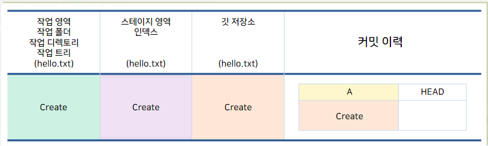
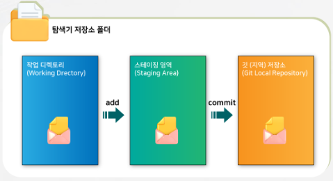
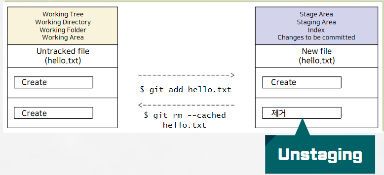

# 깃 3 영역
## 작업 영역
### working directory(folder), working tree
* 탐색기 상의 폴더 하부
## 스테이징 영역
### staging area, index
* 저장소의 .git 폴더의 파일 index
## 깃 저장소(git repository)
### 저장소
* 저장소의 .git 폴더의 여러 정보

### 첫 커밋이 완료된 현재 상태
</img> 
# 파일 생성 후 add, commit 수행
### $ git add
* 파일을 Working tree => Staging Area로 이동(복사)
### $ git commit
* Staging Area에 준비된 파일 => Git repository(버전관리)로 이동(복사)
</img> 
# 깃 상태 보기
## 명령 git status
|주요 명령| 설명 |
|----------|----------|
| $ git status [--long] | 현재의 상태 표시, 기본 값(default value) |
| $ git status [--short / -s] | 현재의 상태를 간단히 표시 |
| $ git config --global --edit | 도움말 보기 |

# 파일 생성
## 리눅스 명령 echo와 수정 라다이렉션(redirection) > 또는 추가 라다이렉션 >>를 사용
### 간단히 텍스트 파일을 생성
PC@DESKTOP-482NOAB MINGW64 /c/[smart Git]/basic (main)   
$ echo create > hello.txt

PC@DESKTOP-482NOAB MINGW64 /c/[smart Git]/basic (main)   
$ cat hello.txt   
create

# untracked file
## 처음 만들어진 파일
### 추적되지 않는 파일(untracked file)
* '깃에 관리되지 않는 파일'의 의미

</img> 
# add 후 상채 보기
## 파일 hello.txt스테이지 영역(index)에 추가하고 깃 상태 보기
</img> 

# add와 unstaging
## $ git rm --cached <file>
### 인덱스인 Changes to be committed(커밋할 수정 내용)에서 삭제(이전 내용으로 수정)

# 커밋
## 커밋(commit)
### 버전 관리를 위해 현재 그테이지 영역의 내용에 대해 스냅샷(snap shot)을 찍는 명령
* 즉 커밋으로 버전 관리를 위해 인덱스에 추가된 파일들의 현재 상태를 저장
### 커밋에는 이력을 관리하기 위해 반드시 커밋 메시지의 저장이 필요
|주요 명령| 설명 |
|----------|----------|
| $ git commit | 커밋 메시지를 입력할 기본 편집기 실행됨 |
| $ git commit -m ‘message' | 커밋 메시지를 직접 입력 [-m / --message] |
| $ git commit -a -m ‘message' | 추가와 커밋을 함께 실행 [-a / --all] |
| $ git commit -am ‘message' | 추가와 커밋을 함께 실행 [-a / --all] |
## Untracked file
### 추가하고 한 이후에 커밋
* 깃에서 추가와 커밋을 동시에 실행 불가능
# $ git commit
## 명령 commit에 옵션 -m을 사용하지 않으면 기본 편집기에서 커밋 메시지를 입력 저장
### $ git commit –m A
PC@DESKTOP-482NOAB MINGW64 /c/[smart Git]/basic (main)   
$ git commit

[main (root-commit) dd3f28a] A

1 file changed, 1 insertion(+)

create mode 100644 hello.txt

$ git config --global core.editor ‘code --wait’   
* 다음을 편집하고 저장(ctrl + S) 후 닫기(ctrl + F4)   
* 첫 줄 A: 메시지 제목   
* 판 줄 띄우고  
* 1st commit: 메시지 내용

# 커밋 성공 후 상태 보기
## 첫 커밋이 성공한 후 상태를 조회
### 커밋할 것은 없고, 작업 트리는 깨끗한(clean)상태
* nothing to commit, working tree clean = 3 영역이 동일한 상태   
PC@DESKTOP-482NOAB MINGW64 /c/[smart Git]/basic (main)   
$ git status   
On branch main   
nothing to commit, working tree clean   
# 버전 로그 이력 확인
## 커밋 로그 이력 보기
### $ git log
|주요 명령| 설명 |
|----------|----------|
| $ git log | 로그 이력 정보를 표시 |
| $ git log --oneline  | 로그 이력을 한 줄로 표시 |
| $ git log [--patch / -p] | 로그 이력과 함께 파일의 변화(이전 커밋과의 차이)를 표시 |

## 로그 결과 이해
### 암호학의 SHA-1(Secure Hash Algorithm 1)
* f(key) = value
* 160비트인 키는 40개의 16진수로 표현
## 커밋 로그 이력 표시 내용의 의미
### 모든 커밋을 구분하기 위한 번호인 커밋 ID, 또는 체크섬(checksum)
* 암호학의 SHA-1(Secure Hash Algorithm 1)사용
 *입력에 대해 16진수 40자리인 160비트(20바이트)해시값을 만드는 암호화 해시 함수
 * 미국 국가안보국이 설계하였으며 미국의 연방 정보 처리 표준
### 실제 커밋 ID는 4개에서 7개까지 기술해도 사용 가능
|구분|내용|비고|
|----|-----|-----|
|커밋 ID 번호 40개의 16진수|commit 'dd3f28a76f6f6abe24b0e5cfc1b99c5ae0af8073'|SHA-1 체크섬|
|가장 최근 커밋(HEAD) -> 브랜치 이름(main)|(HEAD -> main)||
|작성자와 로그 날짜|Author: ai7dnn <ai7dnn@gmail.com>Date: Mon Dec 12 18:37:02 2022 +0900||
|저장된 커밋 메시지|A '1st commit'|제목 내용|

# 옵션 --oneline
## 한 줄로 간략히 표시
### 커밋 ID 일곱자리, (마지막 커밋 HEAD -> 브랜치이름), 커밋 메시지 제목
* 커밋 ID는 40개 16진수 중에서 맨 앞 7개만 표시

# 옵션 --patch 또는 -p
## 커밋정보 뿐 아니라 이전 커밋과 현재 커밋 파일의 파이가 표시
### 첫 커밋이므로
* 이전 커밋은 파일이 없음을 의미하는 /dev/null로 표시
* 현재 커밋은 파일 b/hello.txt 임이 표시

# 커밋 정보 git show
## 특정한 커밋 정보를 확인하려면 명령 git show를 사용
|주요 명령|내용|
|----|-----|
|$ git show|마지막 커밋(HEAD)의 커밋 정보 표시
|$ git show --oneline|커밋 로그 한 줄과 파일 차이 표시|
|$ git show -s|파일 차이는 표시되지 않음|
|$ git show [HEAD]|지정한 commitID의 커밋 정보 표시|
|$ git show [commitID]|지정한 commitID의 커밋 정보 표시|
