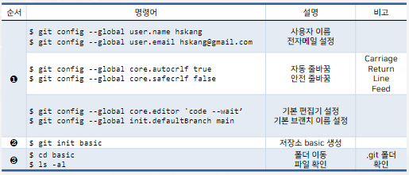
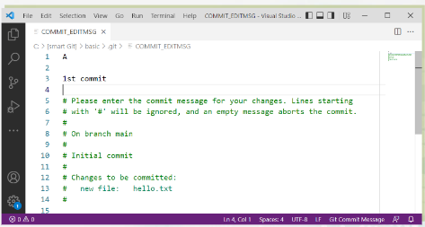
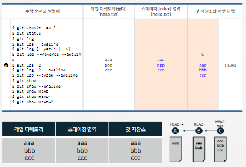

# 깃 설정과 지역 저장소 생성
### 깃 설정과 깃 저장소 basic 생성 실습
</img> 
# 파일 생성과 1st 커밋
### 파일 hello.txt 생성 후 커밋
</img> 
# 2nd 커밋과 파일 수정
</img> 
### 파일 수정 후 커밋: 4 -> 5
### 다시 파일 수정: 6
</img> 
# 로그의 옵션
### 명령 git llog
* 기본적으로 가장 최근의 커밋부터 표시
### 명령 git log 옵션
* --graph
* -n 

|주요 명령|내용|
|---|---|
|$ git log --graph|문자 그림으로 로그 이력 그리기|
|$ git log --reverse|오래된 커밋부터 표시 --graph와 함께 사용할 수 없음|
|$ git log --all|모든 브랜치와 로그 이력 표시|
|$ git log -n|최근 n개의 로그 이력 표시|
# 3rd 커밋과 로그 이력
### $ git log
### $ git show
</img> 
# LOG와 Show
### 세 번의 커밋 이력으로 실습
* HEAD, HEAD~, HEAD~~

  
</img> 
